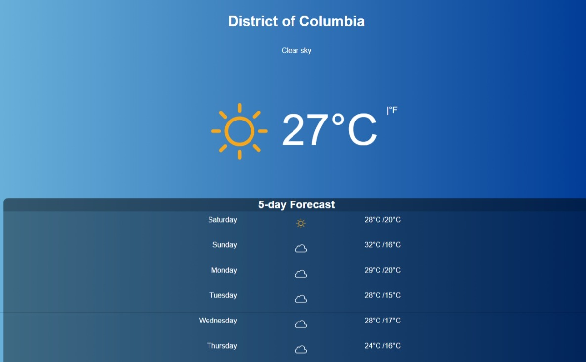

# Weather Forecast App
This Weather Forecast App is a Python application that retrieves data from the OpenWeatherMap API for a given latitude and longitude using the user's location or their ZIP code. It provides information such as current temperature, weather conditions, and icons, as well as a 5-day forecast.

